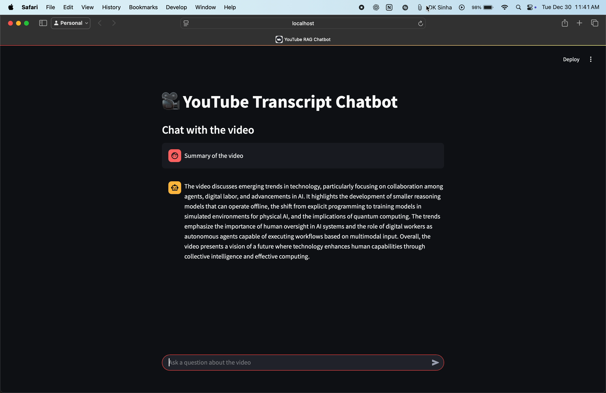

# YouTube Transcript RAG Chatbot

Chat with any YouTube video by indexing its transcript and asking questions in a Streamlit UI. The app fetches the transcript, chunks it, embeds it with OpenAI, and retrieves relevant context to answer your questions.

## Features
- Streamlit UI for loading a YouTube video and chatting with it
- Transcript retrieval via `youtube_transcript_api`
- RAG pipeline with chunking, embeddings, and FAISS similarity search
- Context-grounded answers with a prompt that restricts responses to transcript content

## Demo


## Screenshot


## How It Works
1. Extracts the YouTube video ID from the URL.
2. Fetches the video transcript.
3. Splits the transcript into chunks.
4. Creates embeddings and stores them in a FAISS vector index.
5. Retrieves the most relevant chunks for each user question.
6. Uses an OpenAI chat model to answer strictly from the retrieved context.

## Architecture
```
YouTube URL -> Transcript -> Chunking -> Embeddings -> FAISS -> Retrieval -> LLM Answer
```

The pipeline runs locally and builds a fresh index each time you load a video.

## Requirements
- Python 3.9+ recommended
- OpenAI API key

## Quickstart
1. Create and activate a virtual environment:
   ```bash
   python -m venv .venv
   source .venv/bin/activate
   ```

2. Install dependencies:
   ```bash
   pip install -r requirements.txt
   ```

3. Create a `.env` file and set your OpenAI API key:
   ```bash
   cp .env.example .env
   ```
   Then edit `.env` to include your key:
   ```bash
   OPENAI_API_KEY=your_api_key_here
   ```

## Run the App
```bash
streamlit run app.py
```

## Usage
1. Paste a YouTube URL and click "Check Youtube URL".
2. Click "Load Transcript" to index the transcript.
3. Ask questions in the chat input.

If the transcript is unavailable or not in English, the app will error out during ingestion.

## Tech Stack
- UI: Streamlit
- RAG: LangChain + FAISS
- LLM + Embeddings: OpenAI
- Transcript: `youtube_transcript_api`

## Project Structure
```
.
├── app.py                  # Streamlit UI
├── backend/
│   └── rag_backend.py       # RAG pipeline and chatbot logic
├── assets/                 # Demo media for README
├── requirements.txt
├── test.ipynb               # Optional notebook experiments
└── venv/                    # Local environment (if created)
```

## Configuration Notes
- Models are defined in `backend/rag_backend.py`:
  - Chat model: `gpt-4o-mini`
  - Embeddings model: `text-embedding-3-large`
- Chunking settings:
  - `chunk_size=800`
  - `chunk_overlap=120`
- Retriever uses similarity search with `k=6`

## Design Notes
- The prompt enforces transcript-only answers to reduce hallucinations.
- Chat history is included to preserve conversational context.
- The index is built in-memory per session for simplicity.

## Troubleshooting
- **Transcript not found**: Some videos do not allow transcript access, or only provide non-English transcripts.
- **OpenAI errors**: Ensure `OPENAI_API_KEY` is set and valid.
- **Slow responses**: Transcript size and model latency will affect response time.

## Next Steps
- Add transcript language selection
- Persist the FAISS index between sessions
- Add a "Reset chat" button and multi-video history
